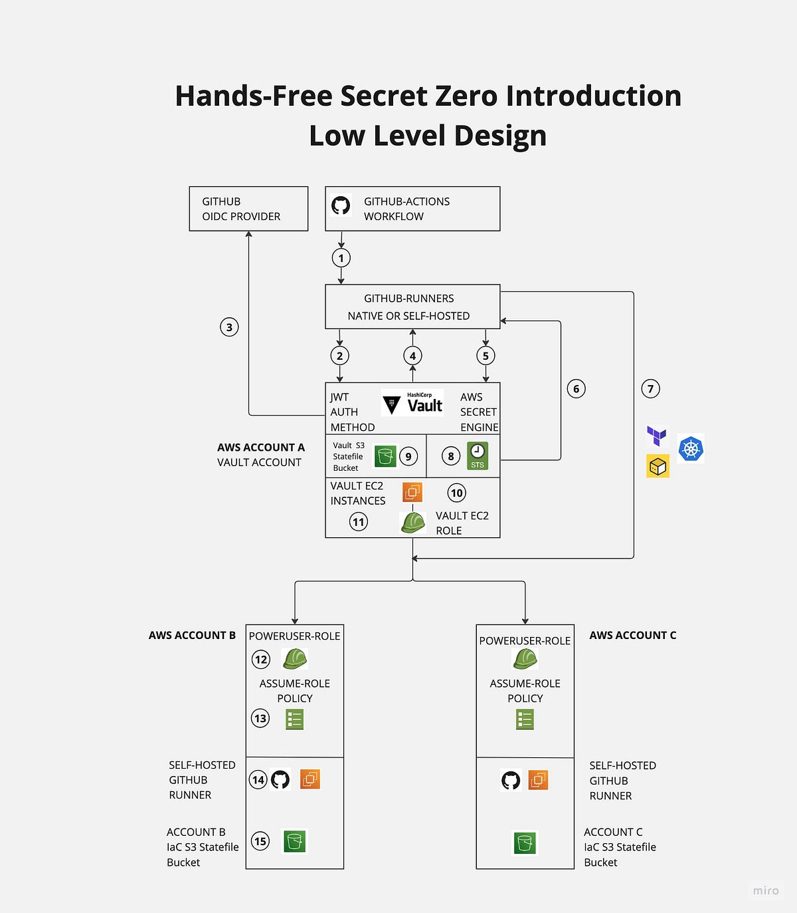

# Solving the Secret Zero and Dynamic Secrets Challenge at Scale: A Guide

 Welcome! This README complements the articles published across various websites addressing the challenges of "Secret Zero" and "Dynamic Secrets" at scale in the AWS ecosystem. This
repository offers in a single location for all the infrastructure as code required to implement the zero-trust blueprint architecture.



### Prerequisites

* Terraform
* Vault Cli
* AWS Cli
* Vault admin token
* Github token with create repositories permissions attached


### AWS accounts

Throughout the tutorial you will find AWS accounts ID and names, please replace them with yours accordingly.

1. 11111111111 - Account-a:
Description: The AWS account with the ID "11111111111" represents "account-a", a generic account where to deploy the
demo S3 bucket.

2. 22222222222 - Account-b:
Description: The AWS account with the ID "22222222222" is designated as "account-b", a generic account where to deploy the
demo S3 bucket.

3. 3333333333 - Vault Account:
Description: This AWS account ID corresponds to the "Vault account". As previously discussed, the Vault account typically serves to host the vault server.

#### Account A & B

For demonstration purposes, it might be more convenient to provision the IAM roles using the AWS CLI. This  method can be more straightforward and immediate for a quick setup or proof of concept.

However, for those who prefer the proper infrastructure-as-code (IaC) or are looking for a more scalable and maintainable approach, I have provided the corresponding Terraform configuration. You can find the Terraform code to achieve the same setup in the examples directory.


1. Account A - Ensure you have the appropriate AWS credentials set for "account-a". Once confirmed, proceed to execute the following steps.

```
aws iam create-role --role-name PowerUserAccountA --assume-role-policy-document "$(cat <<-EOF
{
  "Version": "2012-10-17",
  "Statement": [
    {
      "Effect": "Allow",
      "Principal": {
        "AWS": "arn:aws:iam::33333333333:role/Vault"
      },
      "Action": "sts:AssumeRole"
    }
  ]
}
EOF
)"
```


1. Account B - Ensure you have the appropriate AWS credentials set for "account-b". Once confirmed, proceed to execute the following steps.


```
aws iam create-role --role-name PowerUserAccountB --assume-role-policy-document "$(cat <<-EOF
{
  "Version": "2012-10-17",
  "Statement": [
    {
      "Effect": "Allow",
      "Principal": {
        "AWS": "arn:aws:iam::33333333333:role/Vault"
      },
      "Action": "sts:AssumeRole"
    }
  ]
}
EOF
)"
```


### Vault EC2 instance.

For the purposes of this guide, I assume that you have already provisioned a Vault instance in the your AWS Vault accounts.

To create an IAM role using the AWS CLI and attach a policy with the provided permissions, follow these steps:

1. Create the EC2Vault role and Trust Policy:

```
aws iam create-role --role-name EC2Vault --assume-role-policy-document "$(cat <<-EOF
{
  "Version": "2012-10-17",
  "Statement": [
    {
      "Effect": "Allow",
      "Principal": {
        "Service": "ec2.amazonaws.com"
      },
      "Action": "sts:AssumeRole"
    }
  ]
}
EOF
)"

```


2. Create the Inline Policy with the permissions to assume Power User role on account a and b. Replace respectively 11111111111 and 22222222222 with your AWS accounts.

```
aws iam put-role-policy --role-name YourRoleName --policy-name YourInlinePolicyName --policy-document "$(cat <<-EOF
{
  "Version": "2012-10-17",
  "Statement": [
    {
      "Effect": "Allow",
      "Action": "sts:AssumeRole",
      "Resource": [
        "arn:aws:iam::11111111111:role/PowerUserAccountA",
        "arn:aws:iam::22222222222:role/PowerUserAccountB"
      ]
    }
  ]
}
EOF
)"

```


# Vault and Terraform configuration

!!! WARNING !!!

The setup provided below is meant to be utilised solely for proof of concept (POC) or demonstration purposes. It's crucial to ensure that sensitive data contained within .tfvars files are not accidentally committed to a public repository. For production environments, it's highly recommended to secure, rotate, and manage tokens and credentials  appropriately while assigning the minimum necessary permissions.


This is a one-time procedure to activate the JWT authentication method and configure the GitHub OIDC endpoints in Vault. 

1. Vault login through Vault CLI must be performed.
2. JWT (Json Web Token Auth) auth method must be enabled.
3. Github OIDCs endpoint must be set in Vault


```
vault login

vault auth enable jwt

vault write auth/jwt/config \
     oidc_discovery_url="https://token.actions.githubusercontent.com" \
     bound_issuer="https://token.actions.githubusercontent.com"
```

### Provisioning 


A Makefile has been prepared to orchestrate the necessary automation for creating GitHub repositories, setting up the Vault JWT role, and configuring the AWS secret engine. Through this Makefile, you can streamline the process of executing the required commands to set up these components, making the setup process more manageable and less error-prone.

Makefile


```
init                           Terraform init
plan                           Terraform plan
apply                          Terraform apply
destroy                        Terraform destroy !!!BE CAREFULL!!!!
clean                          This step will clean the environment from tfstate .tfstate.backup .terraform
```

Makefile execution.


Account A 


```
workspace = "account-a"
region    = "<YOUR AWS REGION>"
role_arns = "arn:aws:iam::11111111111:role/PowerUserAccountA"
#Account A statefile infrastructure deployed through Github Actions
statefile_bucket      = "<ACCOUNT-A STATEFILE S3 BUCKET>"
deploy_terraform_demo = true
github_runner         = "ubuntu-latest" # use ubuntu-latest to run it on GitHub platform or use custom name
```


Account B 

```
workspace = "account-b"
region    = "<YOUR AWS REGION>"
role_arns = "arn:aws:iam::22222222222:role/PowerUserAccountB"
#Account A statefile infrastructure deployed through Github Actions
statefile_bucket      = "<ACCOUNT-A STATEFILE S3 BUCKET>"
deploy_terraform_demo = true
github_runner         = "ubuntu-latest" # use ubuntu-latest to run it on GitHub platform or use custom name
```


